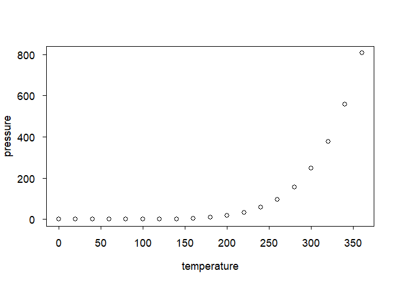

<!-- README.md is generated from README.Rmd. Please edit that file -->

# DescToolsX

<!-- badges: start -->

[](https://github.com/AndriSignorell/DescToolsX/actions/workflows/R-CMD-check.yaml)
<!-- badges: end -->

# Tools for Descriptive Statistics and Exploratory Data Analysis

[DescTools](https://cran.r-project.org/web/packages/DescTools/) has been
available on CRAN for more than 12 years and has undergone a large
number of changes and additions during that time. In this timespan the
package gained impressive popularity and was downloaded a million times
in 2025. However its historical development has led to inconsistencies
that could no longer be resolved through an evolutionary process. It was
time to redesign the package to establish a clean new foundation.


**DescToolsX** is the successor to DescTools, completely redesigned,
decluttered, simplified, bugfixed, unified and substantially
accelerated.

The DescTools collection of functions has been reviewed, reorganised and
grouped into logical units, with particular attention paid to
consistency in operation and user interface design. The new approach
moves away from the monolithic design of DescTools, which had recently
made maintenance so difficult. The functions are now distributed across
several packages, which are, however, loaded directly alongside the main
package, so the user does not need to do anything further.

## 📦 The DescToolsX ecosystem consists of:

**DescToolsX** is the front-end package that automatically loads:

- 🪨 **bedrock**  
  → Core utility functions used across all packages

- 🌌 **aurora**  
  → Plotting, colour handling, and formatting tools

- 💡 **lumen**  
  → Inferential statistics (tests, confidence intervals, distributions)

- 📨 **hermes**  
  → MS Office interface and reporting tools

## Installation

You can install the development version of DescToolsX from
[GitHub](https://github.com/) with:

``` r
# install.packages("pak")
pak::pak("AndriSignorell/DescToolsX")
```

## Example

This is a basic example which shows you how to solve a common problem:

``` r
library(DescToolsX)
#> Loading required package: aurora
#> Part of the DescTools ecosystem. Use DescToolsX for full functionality.
#> Loading required package: lumen
#> Part of the DescTools ecosystem. Use DescToolsX for full functionality.
#> Loading required package: bedrock
#> Loading required package: hermes
## basic example code
```

What is special about using `README.Rmd` instead of just `README.md`?
You can include R chunks like so:

``` r
summary(cars)
#>      speed           dist       
#>  Min.   : 4.0   Min.   :  2.00  
#>  1st Qu.:12.0   1st Qu.: 26.00  
#>  Median :15.0   Median : 36.00  
#>  Mean   :15.4   Mean   : 42.98  
#>  3rd Qu.:19.0   3rd Qu.: 56.00  
#>  Max.   :25.0   Max.   :120.00
```

You’ll still need to render `README.Rmd` regularly, to keep `README.md`
up-to-date. `devtools::build_readme()` is handy for this.

You can also embed plots, for example:



In that case, don’t forget to commit and push the resulting figure
files, so they display on GitHub and CRAN.
