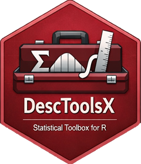

# 📦 DescToolsX 

<!-- badges: start -->
[](https://CRAN.R-project.org/package=DescToolsX)
[](https://www.gnu.org/licenses/old-licenses/gpl-2.0.html)
<!-- badges: end -->

**Title:** Tools for Descriptive Statistics — New Generation\
**License:** GPL (≥ 2)

## 🧩 Overview

`DescToolsX` is the descriptive-statistics layer of the **DescToolsX
ecosystem** and the redesigned successor to `DescTools`. It collects the
routines needed to describe, summarise and explore data before any model
is fitted: frequency and contingency tables, measures of location,
dispersion, shape and concentration, association and agreement
coefficients, effect sizes, and metrics for evaluating classifiers.

A single `desc()` generic dispatches on the type of the input, so a
numeric vector, a factor, a pair of variables or a whole data frame are
all described through the same entry point.

📖 **Documentation:** <https://andrisignorell.github.io/DescToolsX/>

## ⚙️ Installation

``` r
install.packages("DescToolsX")
```

Or the development version from GitHub:

``` r
remotes::install_github("AndriSignorell/DescToolsX")
```

## 📚 Core Features

### 🔹 Describing Data

-   `desc()` — one generic, dispatching on vector, factor, date,
    numeric pair, table or data frame
-   `abstract()` — compact structure of a data frame including labels
-   `freq()`, `freq2D()`, `percTable()`, `expFreq()` — frequency and
    contingency tables
-   `tOne()` — "table one" style summaries

### 🔹 Location, Dispersion and Shape

-   `meanX()`, `medianX()`, `modeX()`, `quantileX()`, `rangeX()`
-   `gmean()`, `hmean()`, `huberM()`, `tukeyBiweight()`,
    `hodgesLehmann()`
-   `varX()`, `madX()`, `iqrX()`, `meanAD()`, `meanSE()`, `coefVar()`
-   `skew()`, `kurt()`

### 🔹 Association and Correlation

-   Nominal: `cramerV()`, `contCoef()`, `phi()`, `tschuprowT()`,
    `lambda()`, `uncertCoef()`, `gkTau()`, `yule()`
-   Ordinal: `ordAssocs()`, `conDisPairs()`, `kendallW()`
-   Continuous: `pearsonCor()`, `spearmanCor()`, `corPart()`,
    `corPolychor()`, `hoeffdingD()`, `findCorrX()`
-   `Association()` — common interface across the measures

### 🔹 Agreement and Reliability

-   `cohenKappa()`, `kappaM()`, `randolphKappa()`, `krippAlpha()`
-   `icc()`, `ccc()`, `percAgreement()`, `pabak()`, `raterFrame()`
-   `cronbachAlpha()`, `blandAltmanData()`
-   `Agreement()` — common interface across the measures

### 🔹 Effect Sizes

-   `cohenD()`, `cohenH()`, `glassDelta()`, `etaSq()`

### 🔹 Model and Classifier Metrics

-   `auc()`, `cStat()`, `brierScore()`
-   `mae()`, `mape()`, `mse()`, `rmse()`, `nmae()`, `nmse()`, `smape()`
-   `isConfusionTable()`, `normalizeToConfusion()`
-   `oddsRatio()`, `relRisk()`

### 🔹 Inequality and Diversity

-   `gini()`, `atkinson()`, `theil()`, `lc()` (Lorenz curve)
-   `herfindahl()`, `rosenbluth()`, `simpson()`, `divCoef()`
-   `entropy()`, `mutInf()`

### 🔹 Dates and Time

-   `addMonths()`, `as_ym()`, `countWorkDays()`, `generation()`,
    `zodiac()`
-   date predicates and conversions, `cutAge()`

### 🔹 Transformation, Binning and Missing Values

-   `boxCox()`, `boxCoxLambda()`, `yeoJohnson()`, `logSt()`, `scaleX()`
-   `cutQ()`, `cut.integer()`
-   `impute()`, `imputeKnn()`
-   `outlier()`, `extremes()`, `lof()`

## 🚀 Design Principles

-   **Consistent** — lowerCamelCase API and uniform argument
    conventions across the whole DescToolsX suite
-   **Fast** — performance-critical routines implemented in Rcpp and
    RcppArmadillo
-   **Generic** — S3 generics with methods for vectors, factors,
    matrices, tables, and data frames
-   **Robust** — validated inputs, informative errors, extensive
    testthat coverage

## 🧪 Example

``` r
library(DescToolsX)

# one generic for very different inputs
desc(iris$Sepal.Length)
desc(iris$Species)
desc(iris)

# frequency table with cumulative columns
freq(iris$Species)

# association between two factors
cramerV(table(mtcars$cyl, mtcars$gear))

# effect size and confidence interval
cohenD(mpg ~ am, data = mtcars)
```

## 🧱 The Suite

`DescToolsX` builds on `bedrock` (base utilities), `pharos` (graphics)
and `lumen` (tests, confidence intervals, distributions). `alloy`
(modelling), `pons` (MS-Office) and `swissValet` (RStudio addins)
complete the family.

## 🙏 Acknowledgements

Parts of the code and documentation were reviewed with the help of large
language models (OpenAI Codex, Anthropic Claude). Every suggestion was
assessed, edited and verified by the maintainer, who remains solely
responsible for the content of this package.

## 📜 License

GPL (≥ 2)
